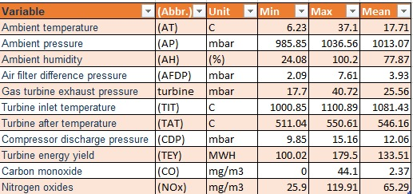

# Introduction
In this article we will predict the net hourly electrical energy output of a combined cycle power plant using four different regression models. The dataset contains 36733 instances of 11 sensor measures aggregated over one hour (by means of average or sum) from a gas turbine located in Turkey's north western region for the purpose of studying flue gas emissions, namely CO and NOx (NO + NO2). We believe the dataset can be well used for predicting turbine energy yield (TEY) using ambient variables as features.We will discuss the data preparation, variable selection, modeling and testing the models in that order. The models will later be compared using well known metrics.

# Data Preparation
## Install and load the necessary packages

```r
requiredPackages = c("janitor","verification","olsrr","DescTools","caret","tibble","purrr","corrplot","corrplot","dbplyr","dplyr","readr", "ggplot2", "glmnet")

for(i in requiredPackages){if(!require(i,character.only = TRUE)) install.packages(i)}
for(i in requiredPackages){if(!require(i,character.only = TRUE)) library(i,character.only = TRUE)}
```


Load the train data.
The source data is available [Here](https://archive.ics.uci.edu/ml/datasets/Gas+Turbine+CO+and+NOx+Emission+Data+Set)   
The description of variables is as below.




```r
data_emissions <- read.csv("gas_train.csv", header = TRUE)
head(data_emissions,6) # the top 6 rows
```

```
##       AT     AP     AH   AFDP   GTEP    TIT    TAT    TEY    CDP      CO    NOX
## 1 4.5878 1018.7 83.675 3.5758 23.979 1086.2 549.83 134.67 11.898 0.32663 81.952
## 2 4.2932 1018.3 84.235 3.5709 23.951 1086.1 550.05 134.67 11.892 0.44784 82.377
## 3 3.9045 1018.4 84.858 3.5828 23.990 1086.5 550.19 135.10 12.042 0.45144 83.776
## 4 3.7436 1018.3 85.434 3.5808 23.911 1086.5 550.17 135.03 11.990 0.23107 82.505
## 5 3.7516 1017.8 85.182 3.5781 23.917 1085.9 550.00 134.67 11.910 0.26747 82.028
## 6 3.8858 1017.7 83.946 3.5824 23.903 1086.0 549.98 134.67 11.868 0.23473 81.748
```


```r
str(data_emissions)
```

```
## 'data.frame':	22191 obs. of  11 variables:
##  $ AT  : num  4.59 4.29 3.9 3.74 3.75 ...
##  $ AP  : num  1019 1018 1018 1018 1018 ...
##  $ AH  : num  83.7 84.2 84.9 85.4 85.2 ...
##  $ AFDP: num  3.58 3.57 3.58 3.58 3.58 ...
##  $ GTEP: num  24 24 24 23.9 23.9 ...
##  $ TIT : num  1086 1086 1086 1086 1086 ...
##  $ TAT : num  550 550 550 550 550 ...
##  $ TEY : num  135 135 135 135 135 ...
##  $ CDP : num  11.9 11.9 12 12 11.9 ...
##  $ CO  : num  0.327 0.448 0.451 0.231 0.267 ...
##  $ NOX : num  82 82.4 83.8 82.5 82 ...
```

## Data preparation

Below we will do some exploratory data analysis, hoping to get the general picture of the data. 

### Finding the missing entries
Variables in columns 67 to 92 are to be removed for the same reason as above. 

```r
# remove more columns
sum(is.na(data_emissions))
```

```
## [1] 0
```

Our data has no missing values, therefore imputation won't be needed. 

### Finding the outliers {.tabset}
Just like the missing values, it is important to check and handle the outliers appropriately for the better model accuracy. 

Let's start with analyzing basic statistics. 

```r
summary(data_emissions)
```

```
##        AT                AP               AH              AFDP      
##  Min.   : 0.2898   Min.   : 985.9   Min.   : 27.50   Min.   :2.087  
##  1st Qu.:11.6645   1st Qu.:1008.8   1st Qu.: 70.29   1st Qu.:3.450  
##  Median :17.7390   Median :1012.4   Median : 82.78   Median :4.069  
##  Mean   :17.7123   Mean   :1012.8   Mean   : 79.56   Mean   :4.038  
##  3rd Qu.:23.6570   3rd Qu.:1016.7   3rd Qu.: 90.53   3rd Qu.:4.451  
##  Max.   :34.9290   Max.   :1034.2   Max.   :100.20   Max.   :7.611  
##       GTEP            TIT            TAT             TEY       
##  Min.   :17.88   Min.   :1001   Min.   :512.5   Min.   :100.2  
##  1st Qu.:22.74   1st Qu.:1075   1st Qu.:542.6   1st Qu.:124.3  
##  Median :24.99   Median :1088   Median :549.9   Median :133.8  
##  Mean   :25.32   Mean   :1083   Mean   :545.5   Mean   :133.5  
##  3rd Qu.:26.84   3rd Qu.:1095   3rd Qu.:550.0   3rd Qu.:138.6  
##  Max.   :37.40   Max.   :1101   Max.   :550.6   Max.   :174.6  
##       CDP               CO                NOX        
##  Min.   : 9.875   Min.   : 0.00039   Min.   : 27.77  
##  1st Qu.:11.395   1st Qu.: 0.99538   1st Qu.: 61.55  
##  Median :12.001   Median : 1.52420   Median : 67.10  
##  Mean   :12.060   Mean   : 2.21439   Mean   : 68.78  
##  3rd Qu.:12.444   3rd Qu.: 2.54240   3rd Qu.: 74.57  
##  Max.   :15.081   Max.   :44.10300   Max.   :119.91
```

```r
# glimpse(data_emissions)
```

Box plots of the variables can indicate the outliers if any. 


```r
library(reshape)
meltData <- melt(data_emissions)
p <- ggplot(meltData, aes(factor(variable), value)) 
p + geom_boxplot() + facet_wrap(~variable, scale="free")
```

<!-- -->
As we can see, variables TIT, CO and NOX have outliers. We will remove the instances with those values in the next stage. 

#### TIT outliers

```r
outlier_TIT <- boxplot(data_emissions$TIT,data = data_emissions)$out
```

<!-- -->

#### CO outliers

```r
outlier_CO <- boxplot(data_emissions$CO,data = data_emissions)$out
```

<!-- -->

#### NOX outliers

```r
outlier_NOX <- boxplot(data_emissions$NOX,data = data_emissions)$out
```

<!-- -->

Remove the outliers. 

```r
data_emissions_clean <- data_emissions[!((data_emissions$TIT %in% outlier_TIT) |(data_emissions$CO %in% outlier_CO) |(data_emissions$NOX %in% outlier_NOX)),]
```

### Distribution of the dependent variable

Now that we have cleaned our data, it is time to take a closer look at the dependent variable, *Turbine Energy Yield (TEY) *. Let's plot it first. 


```r
# distribution of the dependent variable:- TEY
ggplot(data_emissions,
       aes(x = TEY)) +
  geom_histogram(fill = "blue",
                 bins = 100) +
  theme_bw()
```

<!-- -->

> The dependent variable his more or less symmetric, making the variable easier to model. , Therefore,there is no need of log transformation.  

# Variable selection

## Omit the variables with 1 level.
Variables experiencing no change across the observations should be excluded from the model. Let's find out if we have any such variable. 

```r
sapply(data_emissions, 
       function(x) 
         unique(x) %>% 
         length()) %>% 
  sort()
```

```
##    AP   TIT   TAT   CDP   TEY  GTEP  AFDP    AT   NOX    AH    CO 
##   670   722  2587  3977  5013  9827 15228 15988 16359 17316 18104
```

Another way to check this is: 

```r
vars_selected <-names(data_emissions)
var_to_remove <- nearZeroVar(data_emissions, 
                                      names = TRUE)

var_to_remove
```

```
## character(0)
```

> We keep all variables because none has a zero/near zero variance. 

## Remove the collinear (strongly correlated) independent variables
Correlated features in general don't improve models (although it depends on the specifics of the problem like the number of variables and the degree of correlation). The interpretation of effect of individual predictor variables are not reliable when multicolinearity is present. It is important, therefore, to exclude them from the model.

```r
data_emissions_correlations <- cor(data_emissions,
    use = "pairwise.complete.obs")

data_emissions_cor_order <- 
  data_emissions_correlations[,"TEY"] %>% 
  sort(decreasing = TRUE) %>% # sort the correlations with TEY in decreasing order
  names()
```

Plotting the correlations

```r
# using the 30 most correlated variables
corrplot.mixed(data_emissions_correlations[data_emissions_cor_order, 
                                   data_emissions_cor_order],
               upper = "square",
               lower = "number",
               tl.col = "black",
               tl.pos = "lt")
```

<!-- -->

We see that there are variables highly correlated to one another. Next step should be finding the potential candidates to be excluded from the model


```r
vars_to_remove <- findCorrelation(data_emissions_correlations[-8,-8],
                cutoff = 0.9, # threshold
                names = TRUE)

vars_selected <- names(data_emissions)[
  !names(data_emissions) %in% vars_to_remove
]
```


```r
data_emissions <- data_emissions[,vars_selected]
```

> Variable "CDP" has been removed. 


## Omit variables which are linear combinations of one another.
Variables that are linear combinations of other variables should be removed. They do not add anything, but only make everything a little harder. 


```r
( findLinearCombos(data_emissions) ->
    data_emissions_linearCombos )
```

```
## $linearCombos
## list()
## 
## $remove
## NULL
```
> We do not have variables that are linear combinations of each other.

## Insignificant variables
The last stage of variable selection is removing insignificant variables. While this can be done by stepwise variable selection,  an automated Backward elimination can make the task less manual. 
 
1. Run the model with all variables

```r
modelWithallVars <- lm(TEY ~ .,
                          data = data_emissions %>%
                            dplyr::select(all_of(vars_selected))) #
```

2. Remove variables with p value less than 5%

```r
Model_varsRemoved <- ols_step_backward_p(modelWithallVars,
                    prem = 0.05, # p-value threshold
                    progress = FALSE) # hide progress
```

3. Remove the recommended variables

```r
vars_to_remove <- Model_varsRemoved$removed
vars_selected <- vars_selected[!vars_selected %in% vars_to_remove]
```
> Our variables are all significant, none to be removed. 

# Training the model
Once the training and cross validation steps are done, we will need to test our models. It is a good time to load the test data. 

Import the test data. 

```r
data_emissions_train <- data_emissions # train data from the previous steps. 
data_emissions_test <- read.csv("gas_test.csv", header = TRUE)
```

## Methods {.tabset}
Regression can be implemented in various ways. We have used the following 4 models, and their results are to be compared. 
1. Linear Regression
2. Ridge Regression
3. Lasso Regression
4. Elastic Net Regression

### Simple Linear Regression
Linear regression algorithm works by selecting coefficients for each independent variable that minimizes a loss function

```r
Model_SimpleRegr <- lm(TEY ~ ., 
                  data = data_emissions_train %>% 
                   dplyr::select(all_of(vars_selected))) # training the model

summary(Model_SimpleRegr)
```

```
## 
## Call:
## lm(formula = TEY ~ ., data = data_emissions_train %>% dplyr::select(all_of(vars_selected)))
## 
## Residuals:
##     Min      1Q  Median      3Q     Max 
## -7.8278 -0.3815  0.0351  0.4045  6.0224 
## 
## Coefficients:
##               Estimate Std. Error  t value Pr(>|t|)    
## (Intercept) -1.585e+02  1.310e+00 -120.951  < 2e-16 ***
## AT          -3.575e-01  1.549e-03 -230.807  < 2e-16 ***
## AP          -5.727e-02  9.659e-04  -59.291  < 2e-16 ***
## AH          -6.424e-03  5.232e-04  -12.280  < 2e-16 ***
## AFDP        -8.483e-02  8.810e-03   -9.629  < 2e-16 ***
## GTEP         2.964e-01  1.935e-02   15.316  < 2e-16 ***
## TIT          6.834e-01  3.331e-03  205.156  < 2e-16 ***
## TAT         -7.134e-01  5.735e-03 -124.383  < 2e-16 ***
## CO          -1.326e-02  3.762e-03   -3.525 0.000425 ***
## NOX         -1.840e-02  6.920e-04  -26.590  < 2e-16 ***
## ---
## Signif. codes:  0 '***' 0.001 '**' 0.01 '*' 0.05 '.' 0.1 ' ' 1
## 
## Residual standard error: 0.7606 on 22181 degrees of freedom
## Multiple R-squared:  0.9977,	Adjusted R-squared:  0.9977 
## F-statistic: 1.092e+06 on 9 and 22181 DF,  p-value: < 2.2e-16
```

### Ridge Regression
Ridge regression is an extension of linear regression where the loss function is modified by adding a penalty parameter to minimize the complexity of the model.
Ridge regression is a regularization technique, a procedure of penalizing large coefficients to avoid overfitting on the training dataset.

Create model matrix of the train data

```r
x_train = model.matrix(TEY~., data_emissions_train)[,-1] # trim off the first column
                                         # leaving only the predictors
y_train = data_emissions_train$TEY%>%
  unlist() %>%
  as.numeric()
```

Training the ridge model

```r
grid = 10^seq(10, -2, length = 100)
Model_ridge <- glmnet(x_train, y_train, alpha = 0, lambda = grid) # alpha = o for ridge model

summary(Model_ridge)
```

```
##           Length Class     Mode   
## a0        100    -none-    numeric
## beta      900    dgCMatrix S4     
## df        100    -none-    numeric
## dim         2    -none-    numeric
## lambda    100    -none-    numeric
## dev.ratio 100    -none-    numeric
## nulldev     1    -none-    numeric
## npasses     1    -none-    numeric
## jerr        1    -none-    numeric
## offset      1    -none-    logical
## call        5    -none-    call   
## nobs        1    -none-    numeric
```

### Lasso Regression
Lasso regression model is similar to Ridge regression except that the alpha parameter is set to 1. 


```r
Model_lasso <- glmnet(x_train, 
                   y_train, 
                   alpha = 1, 
                   lambda = grid) # Fit lasso model on training data

summary(Model_lasso)
```

```
##           Length Class     Mode   
## a0        100    -none-    numeric
## beta      900    dgCMatrix S4     
## df        100    -none-    numeric
## dim         2    -none-    numeric
## lambda    100    -none-    numeric
## dev.ratio 100    -none-    numeric
## nulldev     1    -none-    numeric
## npasses     1    -none-    numeric
## jerr        1    -none-    numeric
## offset      1    -none-    logical
## call        5    -none-    call   
## nobs        1    -none-    numeric
```

### Elastic Net Regression
Elastic net regression combines the properties of ridge and lasso regression. It works by penalizing the model using both the 1l2-norm1 and the 1l1-norm1. 


```r
# Set training control
train_cont <- trainControl(method = "repeatedcv",
                              number = 5,
                              repeats = 5,
                              search = "random",
                              verboseIter = FALSE)

# Train the model
Model_ENR <- train(TEY ~ .,
                           data = data_emissions_train,
                           method = "glmnet",
                           preProcess = c("center", "scale"),
                           tuneLength = 10,
                           trControl = train_cont)


# Best tuning parameter
Model_ENR$bestTune
```

```
##        alpha     lambda
## 10 0.9975217 0.01312973
```

## Model validation
- Cross validation determines the expected forecast error before looking into the test data. - It can estimate the skill of the model on *unseen data*. That is, to use a limited sample in order to estimate how the model is expected to perform in general when used to make predictions on data not used during the training of the model. 

Finding the lambda parameter that minimizes the mean square error. 

a. Ridge model

```r
set.seed(1)
cv.out = cv.glmnet(x_train, y_train, alpha = 0) # Fit ridge regression model
bestlam = cv.out$lambda.min  # Select lamda that minimizes training MSE
bestlam
```

```
## [1] 1.56789
```

a. Lasso model

```r
set.seed(1)
cv.out = cv.glmnet(x_train, y_train, alpha = 1) # Fit ridge regression model
bestlam2 = cv.out$lambda.min  # Select lamda that minimizes training MSE
bestlam2
```

```
## [1] 0.02328267
```
# Testing the model on out of sample data

## Preparing the test data.
The dataset comes in train and test sets. It is therefore necessary to apply all the data cleaning processes on the test data before applying model prediction. 

Check for missing values

```r
sum(is.na(data_emissions_test)) # any missing value? 
```

```
## [1] 0
```

Remove the outliers. 

```r
data_emissions_test <- data_emissions_test[!((data_emissions_test$TIT %in% outlier_TIT) |(data_emissions_test$CO %in% outlier_CO) |(data_emissions_test$NOX %in% outlier_NOX)),]
```

Remove the same variables removed from the train data. 

```r
data_emissions_test <- data_emissions_test[,vars_selected]
```

Prepare the test data

```r
x_test = model.matrix(TEY~., data_emissions_test)[,-1] # trim off the first column
                                         # leaving only the predictors
y_test = data_emissions_test$TEY%>%
  unlist() %>%
  as.numeric()
```

## Prediction  

Let's find the prediction results for each model. 

```r
Model_SimpleRegrfitted <- predict(Model_SimpleRegr,
                               data_emissions_test)
Model_ridgefitted <- predict(Model_ridge, s = bestlam, newx = x_test)

Model_lassofitted <- predict(Model_lasso, s = bestlam2, newx = x_test)
Model_ENRfitted <- predict(Model_ENR, x_test)
```

# Accuracy measurement

## Visual error distribution
Let's check the histograms of residuals for each model. 

```r
res1 <- data.frame(residual = Model_SimpleRegrfitted - y_test)
res2 <- data.frame(residual = Model_ridgefitted - y_test) 
res3 <- data.frame(residual = Model_lassofitted - y_test)
res4 <- data.frame(residual = Model_ENRfitted - y_test)

res1$model <- 'm1';res2$model <- 'm2';res3$model <- 'm3';res4$model <- 'm4'
colnames(res2) <- c("residual","model")
colnames(res3) <- c("residual","model")
DF_residuals <- rbind(res1, res2,res3,res4)


ggplot(DF_residuals, aes(residual, fill = model)) + geom_density(alpha = 0.2)
```

<!-- -->

## Using correlation
The best model is the one with the largest coorelation coefficient with the true values. 


```r
DF <- data.frame(real = y_test,predicted_1 = Model_SimpleRegrfitted,
                 predicted_2 = Model_ridgefitted, predicted_3 = Model_lassofitted,
                 predicted_4 = Model_ENRfitted,time = 1:length(y_test))
colnames(DF) <- c("real","predicted_1","predicted_2","predicted_3","predicted_4","time")
```


```r
cor(DF[,-c(1,6)],
    DF$real)
```

```
##                  [,1]
## predicted_1 0.9960959
## predicted_2 0.9905734
## predicted_3 0.9950812
## predicted_4 0.9948780
```

> All predictions are strongly correlated with the real/true values. 

## Using statistical metrics
Some of the most commonly used statistical metrics are MSE: mean square error, RMSE: root mean square error, MAE: Mean Absolute Error, R^2:  R squared and others. The "regressionMetrics" function calculates these and other metrics. 


```r
regressionMetrics <- function(real, predicted) {
  MSE <- mean((real - predicted)^2)  # Mean Squera Error
  RMSE <- sqrt(MSE) # Root Mean Square Error
  MAE <- mean(abs(real - predicted)) # Mean Absolute Error
  MAPE <- mean(abs(real - predicted)/real) # Mean Absolute Percentage Error
  MedAE <- median(abs(real - predicted)) # Median Absolute Error
  MSLE <- mean((log(1 + real) - log(1 + predicted))^2) # Mean Logarithmic Absolute Error
  TSS <- sum((real - mean(real))^2) # Total Sum of Squares
  RSS <- sum((predicted - real)^2) # Explained Sum of Squares
  R2 <- 1 - RSS/TSS  # R squared
  
  result <- data.frame(MSE, RMSE, MAE, MAPE, MedAE, MSLE, R2)
  return(result)
}
```

Let's call the function above on all combinations of real, predicted values. 


```r
rm_1 <- regressionMetrics(DF$real,
                  predicted = DF$predicted_1) # model 1
rm_2 <- regressionMetrics(DF$real,
                  DF$predicted_2) # model 2
rm_3 <- regressionMetrics(DF$real,
                  DF$predicted_3) # model 3 
rm_4 <- regressionMetrics(DF$real,
                  DF$predicted_4) # model 4
```

TO compare the results in a table,  

```r
metrics <- rbind(rm_1,rm_2,rm_3,rm_4)
row.names(metrics) <- c("Model_SimpleRegr","Model_ridge","Model_lasso","Model_ENR")
metrics
```

```
##                        MSE     RMSE      MAE       MAPE    MedAE         MSLE
## Model_SimpleRegr 14.383636 3.792576 3.620499 0.02730520 3.621288 0.0008408813
## Model_ridge       8.033953 2.834423 2.445318 0.01791315 2.552413 0.0004266967
## Model_lasso       9.940961 3.152929 2.933573 0.02209878 3.044732 0.0005763688
## Model_ENR         9.511882 3.084134 2.865765 0.02158806 2.975560 0.0005511232
##                         R2
## Model_SimpleRegr 0.9293215
## Model_ridge      0.9605227
## Model_lasso      0.9511520
## Model_ENR        0.9532604
```

# Conclusion
Ridge regression and lasso regression with selected parameters achieve better predicting accuracy than a simple regression model. Elastic Net Regression improves the model accuracy even further. 

